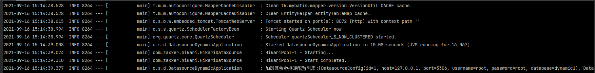
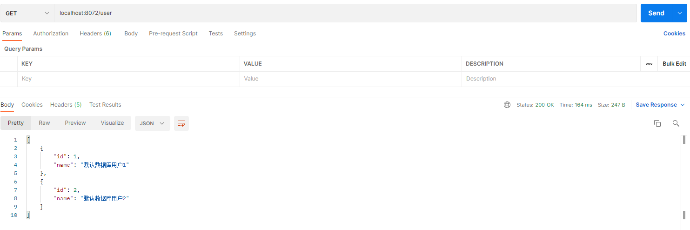

# 动态切换数据源

此 demo 主要演示了 Spring Boot 项目如何通过接口`动态添加/删除`数据源，添加数据源之后如何`动态切换`数据源，然后使用 mybatis 查询切换后的数据源的数据。

## 1. 环境准备

1. 执行 db 目录下的SQL脚本
2. 在默认数据源下执行 `init.sql`

## 2.测试
启动项目，可以看到控制台读取到数据库已配置的数据源信息



通过 PostMan 等工具测试

- 默认数据源查询



- 根据数据源id为1的数据源查询


- 根据数据源id为2的数据源查询


- 可以通过测试数据源的`增加/删除`，再去查询对应数据源的数据

> 删除数据源：
>
> - DELETE http://localhost:8072/config/{id}
>
> 新增数据源:
>
> - POST http://localhost:8072/config
>
> - 参数：
>
> ```
> {
>     "host": "数据库IP",
>     "port": 3306,
>     "username": "用户名",
>     "password": "密码",
>     "database": "数据库"
> }
> ```

## 4. 优化

如上测试，我们只需要通过在 header 里传递数据源的参数，即可做到动态切换数据源，怎么做到的呢？

答案就是 `AOP`

```
/**
 * 数据源选择器切面
 * @author suphowe
 */
@Aspect
@Component
@RequiredArgsConstructor(onConstructor_ = @Autowired)
public class DatasourceSelectorAspect {
    @Pointcut("execution(public * com.soft.dynamic.controller.*.*(..))")
    public void datasourcePointcut() {
    }

    /**
     * 前置操作，拦截具体请求，获取header里的数据源id，设置线程变量里，用于后续切换数据源
     */
    @Before("datasourcePointcut()")
    public void doBefore(JoinPoint joinPoint) {
        Signature signature = joinPoint.getSignature();
        MethodSignature methodSignature = (MethodSignature) signature;
        Method method = methodSignature.getMethod();

        // 排除不可切换数据源的方法
        DefaultDatasource annotation = method.getAnnotation(DefaultDatasource.class);
        if (null != annotation) {
            DatasourceConfigContextHolder.setDefaultDatasource();
        } else {
            RequestAttributes requestAttributes = RequestContextHolder.getRequestAttributes();
            ServletRequestAttributes attributes = (ServletRequestAttributes) requestAttributes;
            HttpServletRequest request = attributes.getRequest();
            String configIdInHeader = request.getHeader("Datasource-Config-Id");
            if (StringUtils.hasText(configIdInHeader)) {
                long configId = Long.parseLong(configIdInHeader);
                DatasourceConfigContextHolder.setCurrentDatasourceConfig(configId);
            } else {
                DatasourceConfigContextHolder.setDefaultDatasource();
            }
        }
    }

    /**
     * 后置操作，设置回默认的数据源id
     */
    @AfterReturning("datasourcePointcut()")
    public void doAfter() {
        DatasourceConfigContextHolder.setDefaultDatasource();
    }

}
```

此时需要考虑，我们是否每个方法都允许用户去切换数据源呢？答案肯定是不行的，所以我们定义了一个注解去标识，当前方法仅可以使用默认数据源。

```
/**
 * 用户标识仅可以使用默认数据源
 * @author suphowe
 */
@Target({ElementType.METHOD})
@Retention(RetentionPolicy.RUNTIME)
@Documented
public @interface DefaultDatasource {
}
```