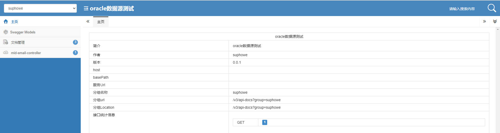
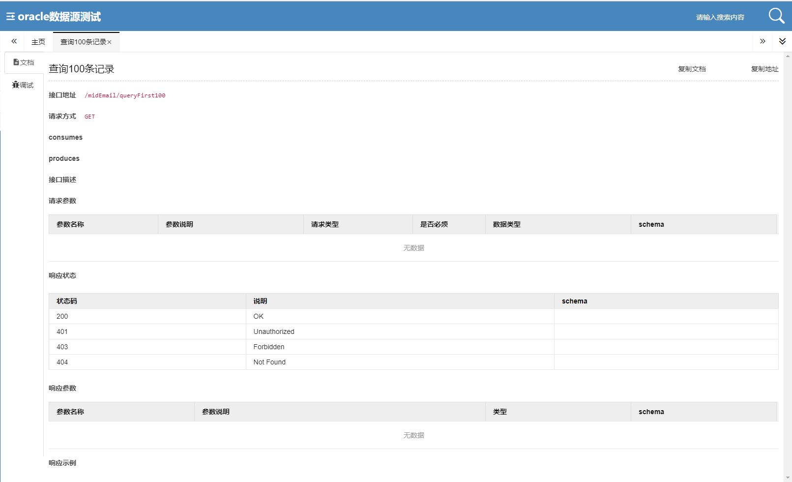

# springboot oracle集成
## ojdbc6 配置问题
驱动包 ojdbc6-11.2.0.4.jar 在maven配置后需要手动进行下载引入
```html
        <dependency>
            <groupId>com.oracle.database.jdbc</groupId>
            <artifactId>ojdbc6</artifactId>
            <version>${oracle-version}</version>
        </dependency>
```
## dependency 完整依赖
```html
        <!-- mybatis -->
        <dependency>
            <groupId>org.mybatis.spring.boot</groupId>
            <artifactId>mybatis-spring-boot-starter</artifactId>
            <version>${mybatis-version}</version>
        </dependency>
        <dependency>
            <groupId>org.springframework.boot</groupId>
            <artifactId>spring-boot-starter-data-jpa</artifactId>
            <version>2.5.4</version>
        </dependency>
        <!-- JdbcTemplate -->
        <dependency>
            <groupId>org.springframework.boot</groupId>
            <artifactId>spring-boot-starter-jdbc</artifactId>
            <version>2.5.4</version>
        </dependency>
        <!--druid-->
        <dependency>
            <groupId>com.alibaba</groupId>
            <artifactId>druid-spring-boot-starter</artifactId>
            <version>1.2.6</version>
        </dependency>
        <!-- mybatis逆向工程 -->
        <dependency>
            <groupId>org.mybatis.generator</groupId>
            <artifactId>mybatis-generator-core</artifactId>
            <version>1.3.3</version>
        </dependency>
        <dependency>
            <groupId>com.oracle.database.jdbc</groupId>
            <artifactId>ojdbc6</artifactId>
            <version>${oracle-version}</version>
        </dependency>
```
## yml 文件完整
```yml
##################### 服务配置 #####################
server:
  port: 8079
  tomcat:
    uri-encoding: UTF-8
  servlet:
    session:
      timeout: 30
spring:
  jpa:
    database: oracle
  datasource:
    # 使用c3p0数据源
    type: com.alibaba.druid.pool.DruidDataSource
    driver-class-name: oracle.jdbc.driver.OracleDriver
    url: jdbc:oracle:thin:@IP地址:1521:DB名称
    username: 用户名
    password: 密码
    # 下面为连接池的补充设置，应用到上面所有数据源中
    # 初始化大小，最小，最大
    initialSize: 1
    minIdle: 3
    maxActive: 216
    # 配置获取连接等待超时的时间
    maxWait: 30000
    # 配置间隔多久才进行一次检测，检测需要关闭的空闲连接，单位是毫秒
    timeBetweenEvictionRunsMillis: 60000
    # 配置一个连接在池中最小生存的时间，单位是毫秒
    minEvictableIdleTimeMillis: 30000
    validationQuery: select 1 from dual
    testWhileIdle: true
    testOnBorrow: false
    testOnReturn: false
    # 打开PSCache，并且指定每个连接上PSCache的大小
    poolPreparedStatements: true
    maxPoolPreparedStatementPerConnectionSize: 20
    # 配置监控统计拦截的filters，去掉后监控界面sql无法统计，'wall'用于防火墙
    filters: stat,wall,slf4j
    # 通过connectProperties属性来打开mergeSql功能；慢SQL记录
    connectionProperties: druid.stat.mergeSql=true;druid.stat.slowSqlMillis=5000
    # 合并多个DruidDataSource的监控数据
    #useGlobalDataSourceStat: true

# 设置，mapper 接口路径，mapper 接口对应的xml 配置文件
mybatis:
  mapper-locations: classpath:mapper/*.xml
  type-aliases-package: com.soft.oracle.dao  #在springboot程序入口类处添加注解@MapperScan("com.soft.oracle.dao")此处可省略，不添加的话这里要写上，每个dao层映射接口也要添加注解@Mapping
```
## 事务开启
在启动类中添加 @EnableTransactionManagement 进行事务的开启
```java
@SpringBootApplication
@EnableTransactionManagement
public class DatasourceOracleApplication {

    public static void main(String[] args) {
        SpringApplication.run(DatasourceOracleApplication.class, args);
    }

}
```
在 service 层中使用 @Transactional 进行事务的控制
```java
    /**
     * 读取前100 行数据
     * 事务控制
     */
    @Transactional(readOnly = true)
    public List<MidEmail> queryFirst100(){
        return MidEmailMapper.queryFirst100();
    }
```
对于更新操作,需要强制性的启动一个事务控制,使用 @Transactional(propagation=Propagation.REQUIRED) 注解来处理
```java
@Transactional(propagation=Propagation.REQUIRED)
```
## druid监控
控制白名单,对web监控的配置处理
```java
    /**
     * 主要实现WEB监控的配置处理
     */
    @Bean
    public ServletRegistrationBean druidServlet() {
        // 现在要进行druid监控的配置处理操作
        ServletRegistrationBean servletRegistrationBean = new ServletRegistrationBean(new StatViewServlet(), "/druid/*");
        // 白名单
        servletRegistrationBean.addInitParameter("allow","127.0.0.1,0.0.0.0");
        // 黑名单(与白名单共同存在时，deny优先于allow)
        // servletRegistrationBean.addInitParameter("deny", "192.228.1.10");
        // 用户名
        servletRegistrationBean.addInitParameter("loginUsername", "admin");
        // 密码
        servletRegistrationBean.addInitParameter("loginPassword", "admin");
        // 是否可以重置数据源
        servletRegistrationBean.addInitParameter("resetEnable", "false");
        return servletRegistrationBean ;
    }
```
```
登录地址
http://localhost:8079/druid/login.html
用户名:admin
密码:admin
```

## 测试页面
[TESTPAGE](http://localhost:8079/doc.html)



## mybatis编写注意事项
mybatis报错:
```
Cause: org.xml.sax.SAXParseException; lineNumber: 6; columnNumber: 105; 元素内容必须由格式正确的字符数据或标记组成
```
XML文件格式错误问题, mybatis中大于，小于，大于等于，小于等于的写法  
### 第一种写法:

| 描述   | 原符号 | 替换符号   |
|:-----|:----|:-------|
| 小于   | <   | \&lt;  |
| 小于等于 | <=  | \&lt;= |
| 大于   | \>  | \&gt;  |
| 大于等于 | \>= | \&gt;= |
| 与    | &   | \&amp; |
| 单引号  | '   | \&apos; |
| 双引号  | "   | \&quot; |

### 第二种写法
```properties
<![CDATA[ 符号 ]]>
```
```properties
例如 >= 写作为 <![CDATA[ >= ]]>
```
## mybatis占位符
### #{}
1.#{}占位符用来设置参数，参数的类型可以有3种，基本类型，自定义类型，map基本类型作为参数，参数与占位符中的名称无关
```html
<select id="findById" parameterType="int" resultType="cn.soft.Role">
        select * from t_role where id = #{xxxid}
</select>
```
2.自定义类型作为参数，自定义类中需要为为属性提供get方法，如果没有提供get方法，那么会根据占位符中的名称去反射获取值，如果占位符中的名称和属性不一致，那么报ReflectionException

3.Map作为参数类型，key和占位符中的名称一致即可，如果名称不一致那么将会把null，传递到占位符中

#### 注意事项
1.不能作为表名  
2.不能作为列名  

### ${}
1.占位符是字符串连接符，可以动态获取相关值  

能从 properties 文件中获取值，也可以作为表名，列名等值。

1.${} 占位符参数只能使用自定义类型和 map 类型。
```html
<!-- 查询所有 -->
<select id="findAll" parameterType="map" resultType="cn.soft.Role">
        select * from ${tableName}
</select>
```
2.作为连接符使用
```html
<select id="selectLike" parameterType="map" resultType="Role">
        select * from t_role where name like '${name}%';
</select>
```


