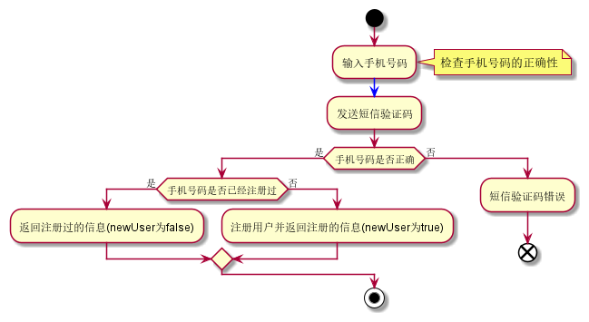

# 通用方法
## 切面编程
### 通过注解配置 Spring AOP
#### 通过注解声明切点指示器
| AspectJ指示器        | 描述    |
| :--------   | :-----   |
| arg()        | 限制连接点匹配参数为指定类型的执行方法      |
| @args()        | 限制连接点匹配参数由指定注解标注的执行方法      |
| execution()        | 用于匹配是连接点的执行方法      |
| this()        | 限制连接点匹配AOP 代理的Bean 引用为指定类型的类      |
| target()        | 限制连接点匹配目标对象为指定类型的类      |
| @target()        | 限制连接点匹配特定的执行对象.这些对象对应的类要具备指定类型的注解      |
| within()        | 限制连接点匹配指定的类型      |
| @within()        | 限制连接点匹配指定注解所标注的类型(当使用Spring AOP时,方法定义在由指定的注解所标注的类里)      |
| @annotation()        | 限制匹配带有指定注解连接点      |
在spring中尝试使用AspectJ其他指示器时，将会抛出IllegalArgumentException异常
#### 通过注解声明 5 种通知类型
```
@Pointcut   定义切点位置
```
| 注解        | 描述    |
| :--------   | :-----   |
| @Before        | 通知方法会在目标方法调用之前执行      |
| @After        | 通知方法会在目标方法返回或异常后调用      |
| @AfterReturning        | 通知方法会在目标方法返回后调用      |
| @AfterThrowing        | 通知方法会在目标方法抛出异常后调用      |
| @Around        | 通知方法会将目标方法封装起来      |


## CacheUtils 缓存

## Java爬虫 CrawlerUtil

## cron表达式

## 跨域配置

### @CrossOrigin
@CrossOrigin 注解配置某一个方法接受某一个域的请求
```$xslt
    @CrossOrigin(value = "http://localhost:8086")
    @GetMapping("/hello")
    public String hello() {
        return "hello";
    }
```
表示接受来自 http://localhost:8086 地址的请求

### 全局跨域
WebMvcConfig.java

### Spring Security 对于CORS的支持
```$xslt
        <!-- springboot security -->
        <dependency>
            <groupId>org.springframework.boot</groupId>
            <artifactId>spring-boot-starter-security</artifactId>
        </dependency>
```
SecurityConfig.java

### OAuth2
GlobalCorsConfiguration.java

## excel操作

## file操作

## CaptchaController 图形验证方法
```
<dependencies>
   <dependency>
      <groupId>com.github.whvcse</groupId>
      <artifactId>easy-captcha</artifactId>
      <version>1.6.2</version>
   </dependency>
</dependencies>
```
https://gitee.com/whvse/EasyCaptcha

http://localhost:8086/graphicverify

## JapiDocCreate Api文档生成
### Address
GitHub：https://github.com/YeDaxia/JApiDocs  
Docs：https://japidocs.agilestudio.cn/#/zh-cn/
### execute
execute JApiDocsUtil.java main method


## master-worker架构,批量执行任务

系统由两个角色组成，Master和Worker  
- Master 负责接收和分配任务
- Worker 负责处理子任务

任务处理过程中，Master还负责监督任务进展和Worker的健康状态;Master将接收Client提交的任务，并将任务的进展汇总反馈给Client


### 任务流程
1.Master对任务进行切分，并放入任务队列；然后，触发Worker处理任务。

实际操作中，任务的分配有多种形式，如Master主动拉起Workder进程池或线程池，并将任务分配给Worker；或者由Worker主动领取任务，这样的Worker一般是常驻进程；还有一种解耦的方式，即Master指做任务的接收、切分和结果统计，指定Worker的数量和性能指标，但不参与Worker的实际管理，而是交由第三方调度监控和调度Worker

## Java调用python程序

### 依赖Jpython
```
<dependency>
    <groupId>org.python</groupId>
    <artifactId>jython-standalone</artifactId>
    <version>2.7.2</version>
</dependency>
```

## 短信验证登陆 smsverify
### 流程图
smsverify.puml


## 雪花ID snowflake

## socket socket服务端及客户端

## swagger 接口Api

## tcp tcp通信

## thread 
批量提交 线程锁 线程池 异步异常处理

## tool
Spring工程文件自动创建 截图工具 工作文件夹创建

## udp通信
服务端 客户端(simple, integration)

## ui
ui窗口创建

## utils
返回结果工具类 系统工具类

## voice
机械声音文件生成

## jasypt 配置文件加密