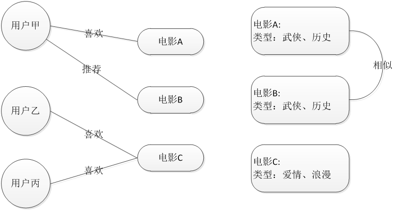

## 为什么使用推荐系统？

促进厂商商品销售，帮助用户找到想要的商品

推荐系统无处不在，体现在生活的各个方面

图书推荐；QQ好友推荐；优酷，爱奇艺的视频推荐；豆瓣的音乐推荐；大从点评的餐饮推荐；世纪佳缘的相亲推荐；智联招聘的职业推荐。

亚马逊的推荐系统深入到网站的各类商品，为亚马逊带来了至少30%的销售额。

## 推荐引擎工作原理

推荐系统主要向用户推荐可能感兴趣商品的系统。系统会给用户以TopN推荐给用户商品。

系统主要使用的数据是用户的历史商品购买记录，这部分数据存放在公司的数据库中。

## Mahout的推荐系统整体架构

　　　　　　
## 推荐系统的实现

### 推荐系统中的算法

- Apriori算法
- 基于用户
- 基于内容
- 基于协同过滤（用的最多）

## Apriori算法-购物篮分析(关联分析)

“啤酒与尿布”的故事产生于20世纪90年代的美国沃尔玛超市。沃尔玛的超市管理人员分析销售数据时发现了一个令人难于理解的现象：在某些特定的情况下，“啤酒”与“尿布”两件看上去毫无关系的商品会经常出现在同一个购物篮中，这种独特的销售现象引起了管理人员的注意，经过后续调查发现。
原来，美国的妇女通常在家照顾孩子，所以她们经常会嘱咐丈夫在下班回家的路上为孩子买尿布，而丈夫在买尿布的同时又会顺手购买自己爱喝的啤酒。这样就会出现啤酒与尿布这两件看上去不相干的商品经常会出现在同一个购物篮的现象。
这个发现为商家带来了大量的利润，但是如何从浩如烟海却又杂乱无章的数据中，发现啤酒和尿布销售之间的联系呢？

## Apriori算法的产生

1993年美国学者Agrawal提出通过分析购物篮中的商品集合，从而找出商品之间关联关系的关联算法，并根据商品之间的关系，找出客户的购买行为。Agrawal从数学及计算机算法角度提出了商品关联关系的计算方法——Apriori算法。
沃尔玛从上个世纪90年代尝试将Aprior算 法引入到POS机数据分析中，并获得了成功，于是产生了“啤酒与尿布”的故事。

## Apriori算法

### 如何寻找？
在历史购物记录中，一些商品总是在一起购买。但人看上去不是那么的直观的，而是隐蔽的。让计算机做这事，设法计算法让计算机自动去找，找到这样的模式(规律)。

### 目标:寻找那些总是一起出现商品。
mahout实战—>机器学习实战

《mahout实战》与《机器学习实战》一起购买的记录数占所有商品记录总数的比例——支持度(整体)
买了《mahout实战》与《机器学习实战》一起购买的记录数占所有购买《mahout实战》记录数的比例——置信度(局部)
需要达到一定的阈值

支持度、置信度越大，商品出现一起购买的次数就越多，可信度就越大。

###支持度 
在所有的商品记录中有2%量是购买《mahout实战》与《机器学习实战》
### 置信度
买《mahout实战》的顾客中有60%的顾客购买了《机器学习实战》

### 作用
找到商品购买记录中反复一起出现的商品，帮能助营销人员做更好的策略，帮助顾客方便购买。

### 策略：
- 1、同时购买的商品放一起
- 2、同时购买的商品放两端

支持度、置信度转化为数学语言进行计算：  
A表示《mahout实战》 B表示《机器学习实战》

support(A->B) = P(AB) （《mahout实战》和《机器学习实战》一起买占总的购买记录的比例）
confidence(A->B) = P(B|A) （购买了《mahout实战》后，买《机器学习实战》占的比例）

- 项集：项的集合称为项集，即商品的组合。
- k项集：k种商品的组合，不关心商品件数，仅商品的种类。
- 项集频率：商品的购买记录数，简称为项集频率，支持度计数。  
注意，定义项集的支持度有时称为相对支持度，而出现的频率(比例)称为绝对支持度。
- 频繁项集：如果项集的相对支持度满足给定的最小支持度阈值，则该项集是频繁项集。
- 强关联规则:满足给定支持度和置信度阈值的关联规则

A=>B的置信度可以由A于A U B的支持度计数计算推出。满足最小支持度计数的项集为频繁项集。  
找关联规则问题，归结为找频繁项集。  
注意:A=>B,B=>A的不同  

### 明确问题
- 1、找出总是在一起出现的商品组合
- 2、提出衡量标准支持度、置信度(达到一定的阈值)
- 3、给出支持度、置信度直观计算方法
- 4、得出在计算方法中起决定因素的是频繁项集
- 5、由频繁项集轻松找到强关联规则

找关联规则--------->找频繁项集  
步骤：  
- 1. 找出所有的频繁项集；这个项集出现的次数至少与要求的最小计数一样。如在100次购买记录中，至少一起出现30次。
- 2. 由频繁项集产生强关联规则；这些关联规则满足最小支持度与最小置信度。

## Apriori算法

先验性质:频繁项集的所有非空子集也一定是频繁的。

逆否命题:若一个项集是非频繁的,则它的任何超集也是非频繁的

## Apriori挑战

### 挑战
多次数据库扫描  
巨大数量的候补项集  
繁琐的支持度计算

### 改善Apriori: 基本想法
减少扫描数据库的次数  
减少候选项集的数量  
简化候选项集的支持度计算  

### FPGROWTH算法（有名）

基于用户的推荐技术

基于内容(物品)的推荐技术

## 协同过滤推荐技术
协同  
- 指协调两个或者两个以上的不同资源或者个体，协同一致地完成某一目标的过程或能力。

原理  
- 协同过滤技术是基于用户对项目的历史偏好，发掘项目之间的相关性，或者是发掘用户间的相关性，根据这些相关性进行推荐。

类别  
- 基于用户的协同过滤推荐 Uesr_CF  
- 基于物品的协同过滤推荐 Item_CF  

## 基于用户的协同过滤推荐技术

## 基于物品的协同过滤推荐技术(评分)

## 实现协同过滤的步骤
- 1、收集用户偏好
- 2、找到相似的用户或物品
- 3、计算推荐

收集用户偏好的方法(评分)

每行3个字段，依次是用户ID,物品ID,用户对物品的评分(0-5分，每0.5分为一个评分点！)

## 计算相似性
用户，物品，评分  
- 什么人喜欢什么，以及程度

相似性的度量
- 欧氏距离相似度
- 皮尔森相似度
- 余弦相似度
- 秩相关系数相似度
- 曼哈顿距离相似度
- 对数似然相似度

欧氏距离相似度计算

## 协同过滤推荐，一般要做好以下几个步骤：

### 1）收集用户偏好
通过用户的行为诸如评分，投票，转发，保存，书签，标记，评论，点击流，页面停留时间，是否购买等获得。所有这些信息都数字化，用一个二维矩阵表示出来。

### 2）数据减噪与归一化操作
用户偏好的二维矩阵，一维是用户列表，另一维是物品列表，值是用户对物品的偏好，一般是 [0,1] 或者 [-1, 1] 的浮点数值。

### 3）找相似的用户和物品，计算相似用户或相似物品的相似度。

### 4）根据相似度作为用户、物品的协同过滤推荐。

## 总结

## Apriori

## 协同过滤

## 使用步骤
### 步骤1：
创建DataModel模型，可以基于文件File的DataModel，也可基于数据库的JDBCDataModel，如果数据库中表数据比较多，推荐耗时非常非常的慢，一般来说数据量都比较大可以基于文件DataModel模型来推荐，也可以将文件上传到hadoop，使用hadoop进行mapreduce计算，提高运算性能。
### 步骤2：
采用欧几里得、皮尔逊等算法计算相似度。
### 步骤3：
构建推荐器，基于用户或基于内容进行推荐。
### 步骤4：
将推荐出来的商品id补全其他数据返回给用户展示

　　　　　　　　　　