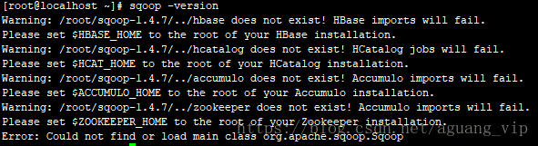
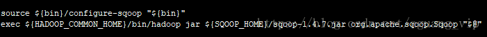
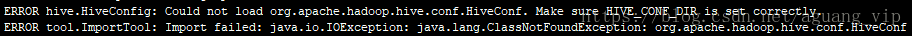
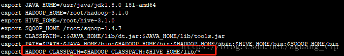
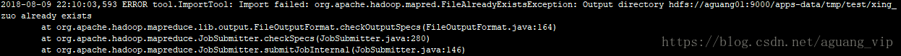
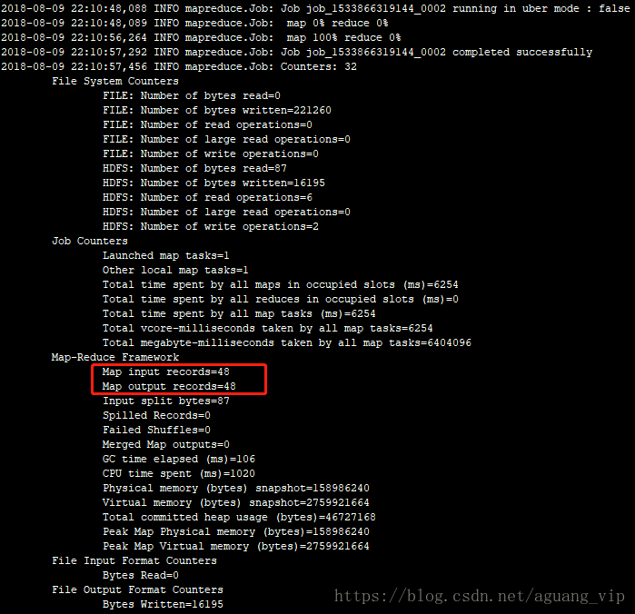
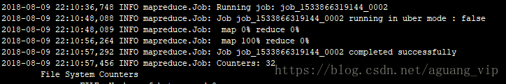
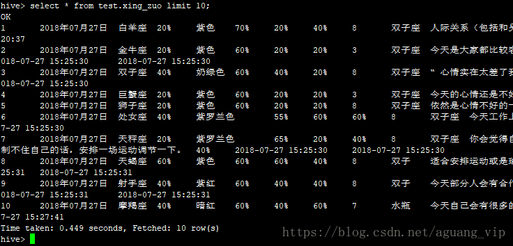
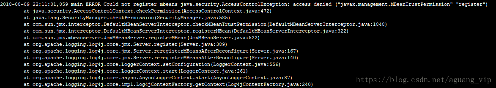

# SQOOP1.4.7安装

## 前言

本次安装是基于hadoop与hive安装完成的基础之上做的，sqoop的安装相对比较简单，主要针对使用的一些问题做了处理，以及写了一个导入的使用方法

## 安装sqoop

### 第一步

下载sqoop
```
https://mirrors.tuna.tsinghua.edu.cn/apache/sqoop/1.4.7/

tar -zxvf sqoop-1.4.7.bin__hadoop-2.6.0.tar.gz
```
重命名
```
mv sqoop-1.4.7.bin__hadoop-2.6.0 sqoop-1.4.7
```
添加环境变量
```
export SQOOP_HOME=/root/sqoop-1.4.7

export PATH=$PATH:$JAVA_HOME/bin:$HADOOP_HOME/bin:$HADOOP_HOME/sbin:$HIVE_HOME/bin:$SQOOP_HOME:bin
```
### 第二步

添加mysql驱动
```
cp mysql-connector-java-5.1.36.jar /root/sqoop-1.4.7/lib/
```
### 第三步

在sqoop的conf目录下，添加配置文件，从模板复制就好
```
cp sqoop-env-template.sh sqoop-env.sh

vi sqoop-env.sh
```
配置
```
export HADOOP_COMMON_HOME=/root/hadoop-3.1.0

export HADOOP_MAPRED_HOME=/root/hadoop-3.1.0

export HIVE_HOME=/root/hive-3.1.0
```
### 第四步

执行sqoop version,看到版本信息，即安装成功



如果最后一行有错误（没有就跳过以下处理）

Error: Could not find or load main class org.apache.sqoop.Sqoop

是因为sqoop1.4.7没有将sqoop-1.4.7.jar包放在tar.gz里，从官网下载一个

Sqoop-1.4.7.jar包，放在sqoop安装目录下

编辑sqoop/bin目录下的sqoop
```
vi sqoop
```
最后一行添加jar ${SQOOP_HOME}/sqoop-1.4.7.jar，修改后为一下
```
exec ${HADOOP_COMMON_HOME}/bin/hadoop jar ${SQOOP_HOME}/sqoop-1.4.7.jar org.apache.sqoop.Sqoop "$@"
```


重新sqoop version,错误不见，至此，sqoop安装完成

### 第五步

新增一个shell文件
```
vi sqoop_import.sh
```
```
mysql_username=root

mysql_password=root

mysql_connection=jdbc:mysql://192.168.110.253:3306/shb

#暂时使用默认队列default，如果有配置其他的队列相应改动

sqoop import -Dmapred.job.queue.name=default \

--connect ${mysql_connection} \

--username ${mysql_username} \

--password ${mysql_password} \

--table XING_ZUO \

--m 1 --hive-table test.xing_zuo \

--hive-drop-import-delims \

--null-non-string '\\N' \

--null-string  '\\N' \

--fetch-size 1000 \

--target-dir /apps-data/tmp/test/xing_zuo \

--hive-import
```
执行sqoop脚本
```
sh sqoop_import.sh
```
出现报错


```
Vi /etc/profile

export HADOOP_CLASSPATH=$HADOOP_CLASSPATH:$HIVE_HOME/lib/*
```


重新跑shell

出现错误



是因为sqoop将数据从关系数据库抽取的时候会先将数据写入hdfs中去，前面已经执行了，所以命令的临时目录已经存在了

在shell里加入
```
hadoop dfs -rmr /apps-data/tmp/test/xing_zuo
```
即在执行sqoop import命令的时候，需要将命令中对应的临时目录所在的路径删除了

执行shell

可以看到




执行成功

启动hive

查询表
```
Select * from test.xing_zuo limit 10;
```


数据已经写入hive表,但是有下面错误，（不影响数据写入）
```
main ERROR Could not register mbeans java.security.AccessControlException: access denied ("javax.management.MBeanTrustPermission" "register")
```


此错误主要是没有权限的问题，修改
```
/usr/java/jdk1.8.0_181-amd64/jre/lib/security java.policy文件
```
加入以下配置，记得后面有分号
```
permission javax.management.MBeanTrustPermission "register";
```
重新执行sqoop脚本，错误没有了

至此，sqoop1.4.7的安装与使用暂时写到这里，后续有时间会更新一些其他命令的使用以及一些场景