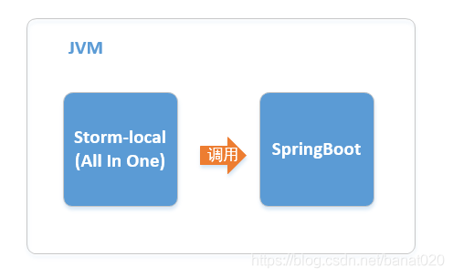
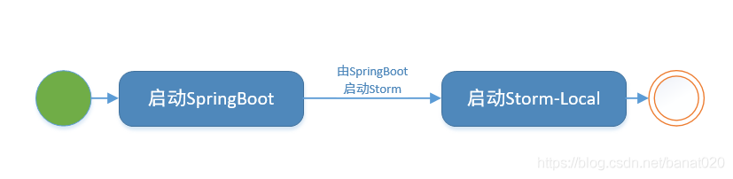
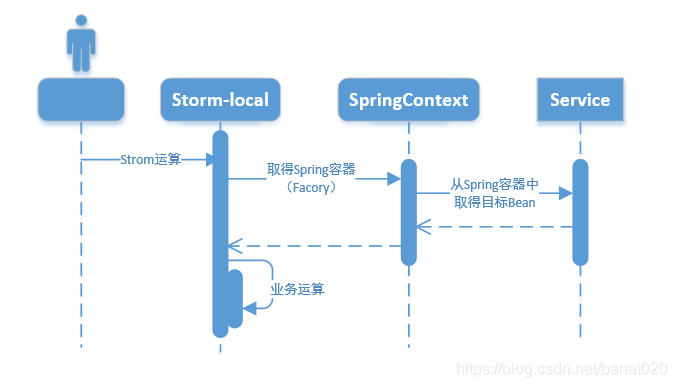
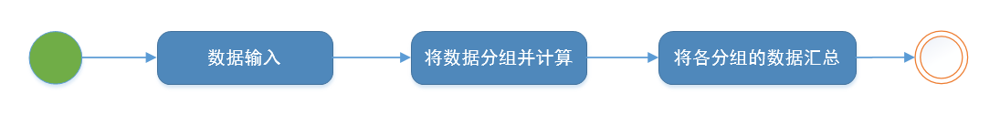

# storm 简介
Storm是一个分布式的实时的流式计算框架。

Storm运行有两种模式，分别是local与remote。

Storm的local就是单进程模式（运行在单一的JVM），local模式storm（注：下文将用storm-local来表示）整合Springboot，这与我们平常的开发方式没有多大区别。storm-local又被叫做测试模式。

Storm的remote是跨进程模式，spout与bolt运行在多个JVM中，也就是说，相互之间的消息通讯要通过远程调用的方式（跨进程）

# storm-local整合Springboot
在架构上，是这样的：

程序启动时，组件的启动顺序是这样的，先启动SpringBoot，storm：

程序启动后，接着就是开始Storm运算，这时，程序运行是这样的：

下面列一个简单的storm-local例子，就是计算1到n的总数，为了扩展storm的知识点（测试），同时还做了些多余的逻辑，应用字段分组。


## bolt
storm提供了两种bolt，BasicBolt和RichBolt，RichBolt在执行execute后要手动提交ack或者fail，
BasicBolt在execute执行后会自动提交ack，但是只对FailedException异常捕获并自动执行fail方法，其他异常需自己处理

- storm的bolt和spout会分发到集群的各个supervisor中，bolt和spout在传输会被序列化和反序列化，
因此在bolt和spout中要尽量避免需要传输不能序列化的对象，若必须使用，可以放到初始化方法里赋值
- 因为第一点提及的问题，bolt和spout同样不要引用其他类的公共变量，因为各个bolt和spout使用的公共变量其实不是同一个对象。
- storm嵌入springBoot程序，不能使用正常springBoot启动的方式，因为在集群中，由于第一点提及的问题，
bolt和spout中不能通过注解的方式获取spring容器中的bean对象，并且因为bolt和spout分发到supervisor中时，都需要启动spring环境，
所以要放在bolt和spout初始化方法中启动
```
    @Override
    public void prepare(Map stormConf, TopologyContext context) {
        //启动spring容器
        SpringBootStormApplication.run();
        super.prepare(stormConf, context);
    }
```
- storm整合springBoot打包项目的时候，不能使用原生springBoot的打包方式，
那种方式的启动是通过org.springframework.boot.loader.JarLauncher类来启动服务的，可以使用以下打包方式
```
            <plugin>
                <groupId>org.apache.maven.plugins</groupId>
                <artifactId>maven-shade-plugin</artifactId>
                <executions>
                    <execution>
                        <phase>package</phase>
                        <goals>
                            <goal>shade</goal>
                        </goals>
                    </execution>
                </executions>
                <configuration>
                    <createDependencyReducedPom>false</createDependencyReducedPom>
                    <artifactSet>
                        <excludes>
                            <exclude>commons-logging:commons-logging</exclude>
                            <exclude>javax.servlet:servlet-api</exclude>
                            <exclude>javax.mail:javax.mail-api</exclude>
                        </excludes>
                    </artifactSet>
                </configuration>
            </plugin>
```