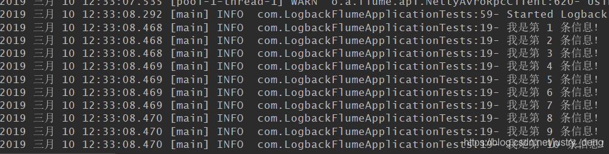

# 软件版本
```
apache-flume-1.9.0-bin.tar.gz
```

# springboot 整合 flume
## step 1 pom.xml
```
        <!-- logback-flume-appender -->
        <dependency>
            <groupId>com.teambytes.logback</groupId>
            <artifactId>logback-flume-appender_2.11</artifactId>
            <version>0.0.9</version>
        </dependency>
```
## step 2 logback-spring.xml
```
<?xml version="1.0" encoding="UTF-8"?>

<configuration>
    <appender name="consoleAppender" class="ch.qos.logback.core.ConsoleAppender">
        <encoder>
            <pattern>%d{yyy MMM dd HH:mm:ss.SSS} [%thread] %-5level %logger{36}:%L- %msg%n</pattern>
        </encoder>
    </appender>

    <!--
        name:自取即可,
        class:加载指定类(ch.qos.logback.core.rolling.RollingFileAppender类会将日志输出到>>>指定的文件中),
        patter:指定输出的日志格式 file:指定存放日志的文件(如果无,则自动创建) rollingPolicy:滚动策略>>>每天结束时，都会将该天的日志存为指定的格式的文件
        FileNamePattern：文件的全路径名模板 (注:如果最后结尾是gz或者zip等的话,那么会自动打成相应压缩包)
    -->
    <appender name="fileAppender" class="ch.qos.logback.core.rolling.RollingFileAppender">
        <!-- 把日志文件输出到:项目启动的目录下的log文件夹(无则自动创建)下 -->
        <file>C:/LOG/suphowe-log-flume.log</file>
        <!-- 把日志文件输出到:name为logFilePositionDir的property标签指定的位置下 -->
        <!-- <file>${logFilePositionDir}/logFile.log</file> -->
        <!-- 把日志文件输出到:当前磁盘下的log文件夹(无则自动创建)下 -->
        <!-- <file>/log/logFile.log</file> -->
        <rollingPolicy
                class="ch.qos.logback.core.rolling.TimeBasedRollingPolicy">
            <!-- TimeBasedRollingPolicy策略会将过时的日志，另存到指定的文件中(无该文件则创建) -->
            <!-- 把因为 过时 或 过大  而拆分后的文件也保存到目启动的目录下的log文件夹下  -->
            <fileNamePattern>C:/LOG/suphowe-log-flume.%d{yyyy-MM-dd}.%i.log</fileNamePattern>
            <!-- 设置过时时间(单位:<fileNamePattern>标签中%d里最小的时间单位) -->
            <!-- 系统会删除(分离出去了的)过时了的日志文件 -->
            <!-- 本人这里:保存以最后一次日志为准,往前7天以内的日志文件 -->
            <MaxHistory>7</MaxHistory>
            <!-- 滚动策略可以嵌套；
                     这里嵌套了一个SizeAndTimeBasedFNATP策略，
                        主要目的是: 在每天都会拆分日志的前提下，
                        当该天的日志大于规定大小时，
                        也进行拆分并以【%i】进行区分，i从0开始
            -->
            <timeBasedFileNamingAndTriggeringPolicy class="ch.qos.logback.core.rolling.SizeAndTimeBasedFNATP">
                <maxFileSize>50MB</maxFileSize>
            </timeBasedFileNamingAndTriggeringPolicy>
        </rollingPolicy>
        <encoder>
            <pattern>%d{yyy MMM dd HH:mm:ss.SSS} [%thread] %-5level %logger{36}:%L- %msg%n</pattern>
        </encoder>
    </appender>

    <!-- flume 配置 -->
    <appender name="flumeTest" class="com.teambytes.logback.flume.FlumeLogstashV1Appender">
        <!-- flume 的url -->
        <flumeAgents>
            localhost:44444
        </flumeAgents>
        <flumeProperties>
            connect-timeout=4000;
            request-timeout=8000
        </flumeProperties>
        <batchSize>100</batchSize>
        <reportingWindow>1000</reportingWindow>
        <additionalAvroHeaders>
            myHeader = myValue
        </additionalAvroHeaders>
        <application>suphowe's Application</application>
        <layout class="ch.qos.logback.classic.PatternLayout">
            <pattern>%d{HH:mm:ss.SSS} %-5level %logger{36} - \(%file:%line\) - %message%n%ex</pattern>
        </layout>
    </appender>

    <logger name="com" level="info">
        <appender-ref ref="flumeTest"/>
    </logger>

    <root level="info">
        <appender-ref ref="consoleAppender"/>
    </root>
</configuration>
```
## step 3 修改Flume所在服务器上的Flume的配置文件，将数据传输格式改为avro


注：avro是hadoop的一个子项目，提供的功能与thrift、Protocol Buffer类似，都支持二进制高效序列化，也
自带RPC机制，但是avro使用起来更简单，无需象thrift那样生成目标语言源代码，目前支持的语言有
java、c#、php、c++等。  
追注：Avro就是用来在传输数据之前，将对象转换成二进制流，然后此二进制流达到目标地址后，Avro再
将二进制流转换成对象。.

注：xxxA.sources.xxxB.bind的值如果写的是localhost，那么只能本机才能访问，所以这里要写成服务器的ip
地址，如果在/etc/hosts文件中配置了主机名，那么也可以写主机名(如上图所示)。

## step 4 开放Flume对应的端口
```
# CentOS7开放端口
firewall-cmd --zone=public --add-port=44444/tcp --permanent
# CentOS7重新加载防火墙
firewall-cmd --reload
#(CentOS)查看所有开放的端口
firewall-cmd --zone=public --list-ports	
```


## step 5 启动Flume服务
前台启动方式：
```
# 前台启动
/var/local/flume/bin/flume-ng agent --conf /var/local/flume/conf/ --conf-file /var/local/flume/conf/flume.conf --name a1 -Dflume.root.logger=INFO,console
```
后台启动方式：
```
# 后台启动
nohup /var/local/flume/bin/flume-ng agent --conf /var/local/flume/conf/ --conf-file /var/local/flume/conf/flume.conf --name a1 -Dflume.root.logger=INFO,console >/flume.log &
```
(前台启动)执行效果如图：


## step 6 编写一个程序，并且该程序记录日志输出


_注：如果要往flume输送日志信息，那么在记录日志时最好不要使用{}占位符，要不然flume收到的信息的对应位置 可能就是占位符{}本身_

## step 7 运行该程序，控制台输出



