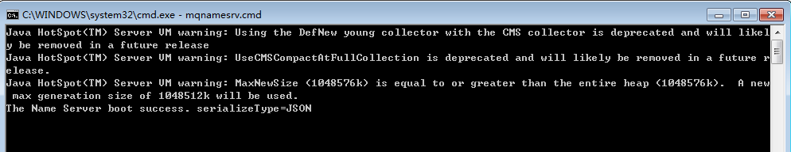
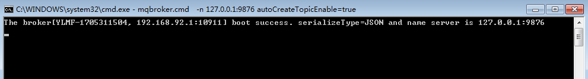
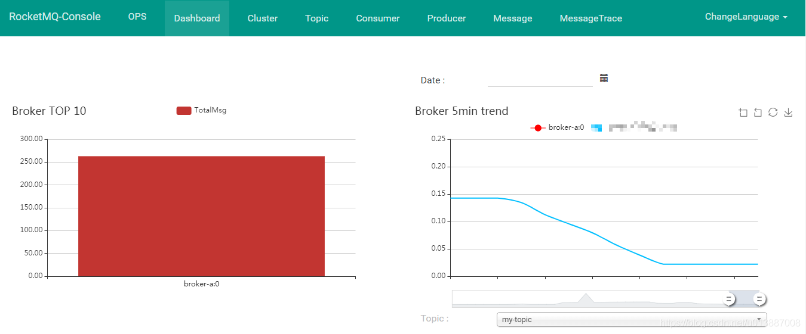

# rocketmq

## windows环境下启动rocketmq、broker
```
# bin目录下
# 启动namesrv
start mqnamesrv.cmd
# 启动broker
start mqbroker.cmd -n 127.0.0.1:9876 autoCreateTopicEnable=true

# broker启动失败处理
删除用户文件夹下的store文件夹
```
rocketmq 启动成功

broker启动成功


## rocketmq控制台rocketmq-console
```
1.修改 rocketmq-console/src/main/resources/application.properties 中配置的端口
2.打包rocketmq-console工程：mvn clean package -Dmaven.test.skip=true
3.启动管理控制台：java -jar rocketmq-console-ng-1.0.1.jar
```
控制台启动成功


### producer 
负责发送消息  
### consumer 
负责消费producer发送的消息  
### brokerServer 
负责消息的接收，存储和分发，是rocketmq最核心，最重量级的组成部分。为实现高可用和高吞吐，brokerServer通常采用集群部署，共同对外提供服务  
### nameServer
负责提供路由元数据。例如，brokerServer通常是集群部署的，其拓扑结构会经常的发生变化。如果每次集群中broker机器的上下线都需要通知所有的消费者、生产者，效率太低  
 
## 1.topic 主题
　　topic主题，代表一系列消息的集合，任何消息只能属于一个topic主题，主题是rocketmq进行消息发布订阅的最小单位。业务方可以通过创建并订阅各式各样的主题来满足自身的业务要求。不同主题之间的消息在逻辑上没有关联。
## 2.tag 标签
　tag标签，tag从属于topic主题，主要用于对同一主题下的消息进行进一步区分。标签可以简单的认为是二级主题，通过tag标签功能，业务方可以方便的实现对各种二级主题的消费需求。
## 3.group 组
  group组，代表着同一类客户端的集合。具体可分为消费者组（consumer group）和生产者组（producer group）两种 。消费者组和生产者组之间没有任何关联(即使组名一样)。
## 消费者组：
　　消费者组代表着同一类型的消费者集群。同一消费者组内的消费者通常消费同样的消息且消息消费逻辑一致。消费者组的概念使得consumer集群在消费消息时，rocketmq可以通过负载均衡来做到消费消息时的高可用和容错。消费者组的更多作用将会在后面的集群/广播消费模式中继续讲解。
## 生产者组：
　　生产者组代表着同一类型的生产者集群。一般来说，消息的生产者在发出了消息得到确认之后便完成了任务，似乎没有必要为此抽象出生产者集群的概念。
　　前面说到，rocketmq具有发送事务消息的特性，发送事务消息简单来说就是生产者先发送出一个半消息(预消息)，然后执行本地的事务，在事务完成提交之后再跟着发送一个事务确认消息。半消息和普通消息的最大区别在于，半消息在投递给broker之后，broker不会马上让消费者进行消费，而是等待。只有当接收到生产者后续对应的的事务确认消息后，预消息和确认消息合二为一，才将对应的事务消息交给消费者去消费；而如果最终没有接收到事务确认消息，则会将消息直接删除不投递给消费者，以达到类似事务回滚的效果。事务消息对消费者来说是透明无感知的。
　　可如果生产者在发送了预消息之后挂了怎么办？为解决这个问题，broker会在一定时间没有收到确认消息后，定时的回查生产者当前事务消息的状态，回查的范围是整个生产者组中的某一个在线节点。这种情况下，生产者和消费者一样，也构成了一个集群监听来自broker的回查。这样，即使发送消息的生产者发生了故障，在一定条件下整个生产者集群的事务消息发送功能依然可以正常运转。
　　通过生产者组的概念，rocketmq实现了事务消息投递的高可用。。
 
## 集群消费：
　　对于任意一条被订阅的消息，同一消费者组下的节点只有一个节点对其进行消费；一个消费者组中的全部节点分摊所有消息。
## 广播消费：
　　对于任意一条被订阅的消息，同一消费者组下的所有节点都会对其进行消费；一个消费者组中的全部节点都能接收到全量的消息。
## 混合模式消费：
　　实质上是前两者的综合。同一应用集群构成一个消费者组，不同应用集群之间构成多个不同的消费者组，但却可以订阅同一个topic/tag下的消息

## DefaultMQPushConsumer
```
//订阅主题为topic的消息，并且可以通过subExpression过滤消息
public void subscribe(String topic, String subExpression){}
//订阅主题为topic的消息，可以订阅某Class实例的消息
public void subscribe(String topic, String fullClassName, String filterClassSource){}
//订阅主题为topic的消息，使用MessageSelector过滤消息
public void subscribe(final String topic, final MessageSelector messageSelector){}
//取消订阅主题为topic的消息
public void unsubscribe(String topic){}
//消息模型，支持集群消费和广播消费，默认为集群消费
public void setMessageModel(MessageModel messageModel){}
//Consumer 启动后，默认从什么位置开始消费,默认为CONSUME_FROM_LAST_OFFSET
public void setConsumeFromWhere(ConsumeFromWhere consumeFromWhere) {}
//集群模式下消息队列Rebalance 算法实现策略
public void setAllocateMessageQueueStrategy(AllocateMessageQueueStrategy allocateMessageQueueStrategy){}
//消费进度存储
public void setOffsetStore(OffsetStore offsetStore){}
//消费线程池数量的最大值
public void setConsumeThreadMax(int consumeThreadMax) {}
//消费线程池数量的最小值
public void setConsumeThreadMin(int consumeThreadMin){}
//单队列并行消费允许的最大跨度
public void setConsumeConcurrentlyMaxSpan(int consumeConcurrentlyMaxSpan){}
//默认值为1000，每1000次流控后打印流控日志
public void setPullThresholdForQueue(int pullThresholdForQueue) {}
//推模式下拉取任务间隔时间，默认一次拉取任务完成继续拉取
public void setPullInterval(long pullInterval) {}
//每次消息拉取拉取的消磁条数，默认为32条
public void setPullBatchSize(int pullBatchSize) {}
//消息并发消费时一次消费的消息条数
public void setConsumeMessageBatchMaxSize(int consumeMessageBatchMaxSize) {}
//是否每次拉取消息都更新订阅信息，默认为false
public void setPostSubscriptionWhenPull(boolean postSubscriptionWhenPull) {}
//最大消费重试次数
public void setMaxReconsumeTimes(final int maxReconsumeTimes){}
//延迟将队列的消息提交到消费线程的等待时长，默认为延迟1秒
public void setSuspendCurrentQueueTimeMillis(final long suspendCurrentQueueTimeMillis) {}
//信息消费超时时间，默认为15秒
public void setConsumeTimeout(final long consumeTimeout) {}
```
