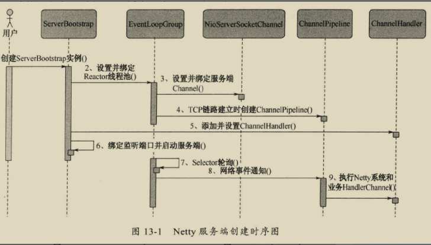
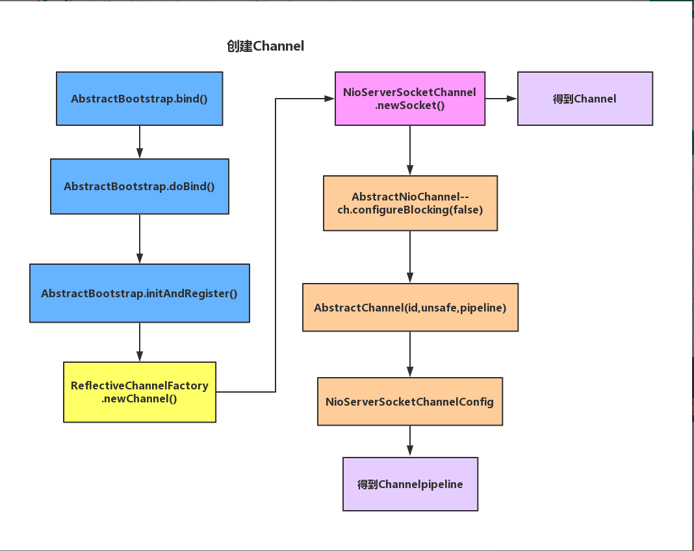
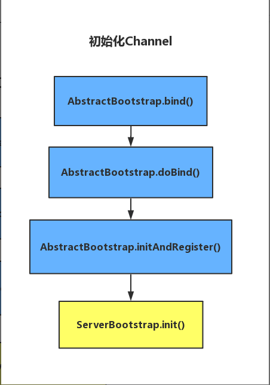
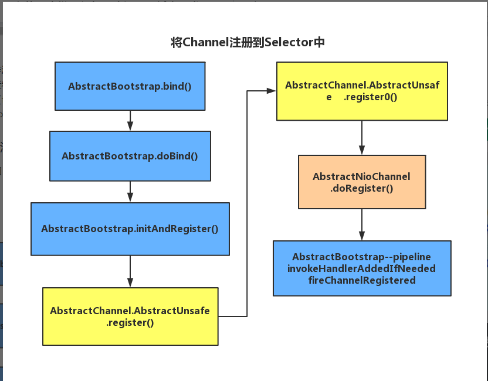
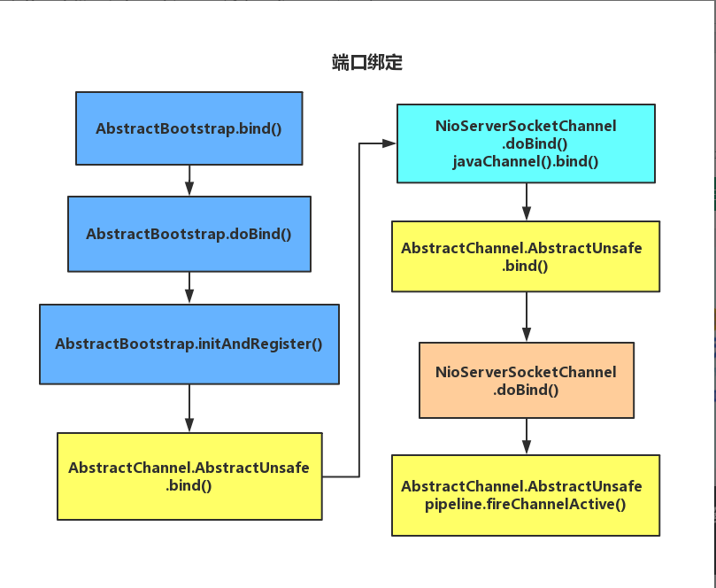

# netty

## netty 模型
```
                        ________________________                                 __________________________
                       |                        |                               |                          |    
                       |   <-----Inbound-----   |                               |   ---inbound------- >    |   ________
                       |   _____        ______  |                               |    _______      ____     |  |        |
           _______     |  |     |       |    |  |                               |    |     |     |    |    |  |        |  
          |       |    |  |  ②  |       |  ③ |  |      ___________________      |    |  ⑤  |     |  ⑥ |    |  |        |
          |       |    |  |_____|       |____|  |     |                   |     |    |_____|     |____|    |  |        |     
          |client |----|-------______-----------|-----|      network      |-----|--------------------------|--| server |
          |       |    |       |     |          |     |___________________|     |          ______          |  |        |
          |       |    |       |  ①  |          |                               |          |     |         |  |        |         
          |       |    |       |_____|          |                               |          |  ④  |         |  |________|
          |       |    |                        |                               |          |_____|         |
          |_______|    |   -----Outbound--->    |                               |    <-----outbound----    | 
                       |___ChannelPipeline______|                               |______ChannelPipeline_____| 
                                                                                    
       ①：StringEncoder继承于MessageToMessageEncoder，而MessageToMessageEncoder又继承于ChannelOutboundHandlerAdapter
       ②：HelloWorldClientHandler.java
       ③：StringDecoder继承于MessageToMessageDecoder，而MessageToMessageDecoder又继承于ChannelInboundHandlerAdapter
       ④：StringEncoder 编码器
       ⑤：StringDecoder 解码器
       ⑥：HelloWorldServerHandler.java
```


## ChannelHandlerContext
可通过 ChannelHandlerContext实例 获取所有的信息
```
如果一个channelPipeline中有多个channelHandler时，且这些channelHandler中有同样的方法时，
例如这里的channelActive方法，只会调用处在第一个的channelHandler中的channelActive方法，
如果你想要调用后续的channelHandler的同名的方法就需要调用以“fire”为开头的方法了，这样做很灵活
目前来说这样做的好处：
1）每一个handler只需要关注自己要处理的方法，如果你不关注channelActive方法时，
    你自定义的channelhandler就不需要重写channelActive方法
2）异常处理，如果 exceptionCaught方法每个handler都重写了，只需有一个类捕捉到然后做处理就可以了，
    不需要每个handler都处理一遍
3）灵活性

```

## netty server
netty 服务端接收报文格式

| 字段 | 描述 | 类型 | 是否必填 |
| ------ | ------ | ------ | ------ |
| user | 操作人员 | String | 是 |
| targetUser | 发送目标 | String | 是 |
| transcode | 交易码 | int | 是 |
| data | 交易信息 | Object | 是 |
```
{
	"user": "登录用户",
	"targetUser": "信息发送目标用户",
	"transcode": 100001,  //交易代码
	"data": "交易信息" 
}
```
客户端需要通过填写登录用户及目标用户确定发送信息，通过交易代码确定交易处理方式  
交易代码如下

| 交易码 | 交易描述 |
| ------ | ------ |
| 1000 | 交易大类1 |
| 100001 | 子类01 |
| 100002 | 子类02 |
| 100003 | 子类03 |
| 100004 | 子类04 |
| 999999 | 初始化，登录时发送 |

## netty 服务端创建步骤
1、创建ServerBootStrap实例  
2、设置并绑定Reactor线程池：EventLoopGroup，EventLoop就是处理所有注册到本线程的Selector上面的Channel  
3、设置并绑定服务端的channel  
4、5、创建处理网络事件的ChannelPipeline和handler，网络时间以流的形式在其中流转，handler完成多数的功能定制：比如编解码 SSl安全认证  
6、绑定并启动监听端口  
7、当轮训到准备就绪的channel后，由Reactor线程：NioEventLoop执行pipline中的方法，最终调度并执行channelHandler  
  

## ServerBootStrap 引导启动服务端
1.创建服务端Channel  
2.初始化服务端Channel  
3.将Channel注册到selector  
4.端口绑定  

### 1.创建服务端Channel
流程：
首先从用户代码的bind()其实就是AbstractBootstrap.bind(),然后通过反射工厂将用户通过b.channel(NioServerSocketChannel.class)传入的NioServerSocketChannel通过调用底层的jdk的SelectorProvider创建channel，同时也接着创建好对应的ChannelPipeline  
  

### 2.初始化服务端Channel
主要工作如下：  
1.设置的option缓存到NioServerSocketChannelConfig里  
2.设置的attr设置到channel里  
3.保存配置的childOptions，配置的childAttrs 到ServerBootstrapAcceptor里  
4.往NioSocketChannel的pipeline中添加一个ServerBootstrapAcceptor  
ServerBootstrapAcceptor在channelRead事件触发的时候（也就有客户端连接的时候），把childHandler加到childChannel Pipeline的末尾，设置childHandler的options和attrs，最后把childHandler注册进childGroup  
  

### 3.将Channel注册到selector
Channel 注册过程所做的工作就是将 Channel 与对应的 EventLoop 关联。  
1.每个 Channel 都会关联一个特定的 EventLoop, 并且这个 Channel 中的所有 IO 操作都是在这个 EventLoop 中执行的;  
2.当关联好 Channel 和 EventLoop 后, 会继续调用底层的 Java NIO SocketChannel 的 register 方法, 将底层的 Java NIO SocketChannel 注册到指定的 selector 中.  
通过这两步, 就完成了 Netty Channel 的注册过程.  
 

### 4.端口绑定
netty端口绑定是调用 jdk的javaChannel().bind(localAddress, config.getBacklog());进行绑定，然后TCP链路建立成功，Channel激活事件，通过channelPipeline进行传播。  
   
