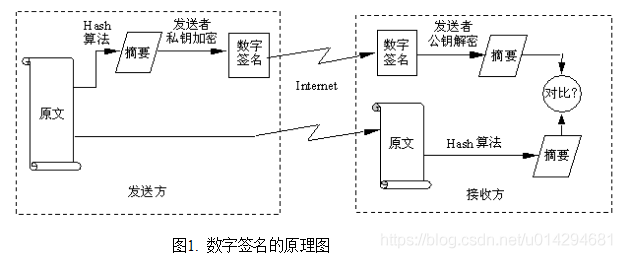

# token 验证

## 目录结构
├── Readme.md                               //help  
├── bean                                    //对象  
│   └── User.java                           //用户  
├── service                                 //服务  
│   ├── ITokenService.java                  //token接口  
│   ├── IUserService.java                   //用户接口  
│   └── impl                                //实现类    
│       ├── TokenServiceImpl.java           //token实现服务类  
│       └── UserServiceImpl.java            //用户实现服务类  
├── util                                    //工具类  
│   ├── TokenUtil.java                      //token工具类   
│   └── AuthenticationInterceptor.java      //自定义拦截器(实现拦截还是放通的逻辑)  
├── InterceptorConfig.java                  //拦截器  
├── PassToken.java                          //跳过验证的注解接口  
└── UserLoginToken.java                     //需要用户登陆验证注解接口 

───TokenController.java                     //token测试controller  

## token引入

### pom.xml引入
```$xslt
        <!-- java-jwt token验证 -->
        <dependency>
            <groupId>com.auth0</groupId>
            <artifactId>java-jwt</artifactId>
            <version>3.4.0</version>
        </dependency>
```


# RSA算法
## 简介
RSA 是目前最有影响力的公钥加密算法，该算法基于一个十分简单的数论事实：将两个大素数相乘十分容易，但想要对其乘积进行因式分解却极其困难，因此可以将乘积公开作为加密密钥，即公钥，而两个大素数组合成私钥。公钥是可发布的供任何人使用，私钥则为自己所有，供解密之用。
## 工作流程
A 要把信息发给 B 为例，确定角色：A 为加密者，B 为解密者。首先由 B 随机确定一个 KEY，称之为私钥，将这个 KEY 始终保存在机器 B 中而不发出来；然后，由这个 KEY 计算出另一个 KEY，称之为公钥。这个公钥的特性是几乎不可能通过它自身计算出生成它的私钥。接下来通过网络把这个公钥传给 A，A 收到公钥后，利用公钥对信息加密，并把密文通过网络发送到 B，最后 B 利用已知的私钥，就能对密文进行解码了。以上就是 RSA 算法的工作流程。
## 运算速度
由于进行的都是大数计算，使得 RSA 最快的情况也比 DES 慢上好几倍，无论是软件还是硬件实现。速度一直是 RSA 的缺陷。一般来说只用于少量数据加密。RSA 的速度是对应同样安全级别的对称密码算法的1/1000左右。  
比起 DES 和其它对称算法来说，RSA 要慢得多。实际上一般使用一种对称算法来加密信息，然后用 RSA 来加密比较短的公钥，然后将用 RSA 加密的公钥和用对称算法加密的消息发送给接收方。  
这样一来对随机数的要求就更高了，尤其对产生对称密码的要求非常高，否则的话可以越过 RSA 来直接攻击对称密码。
## 公钥传递安全
和其它加密过程一样，对 RSA 来说分配公钥的过程是非常重要的。分配公钥的过程必须能够抵挡中间人攻击。假设 A 交给 B 一个公钥，并使 B 相信这是A 的公钥，并且 C 可以截下 A 和 B 之间的信息传递，那么 C 可以将自己的公钥传给 B，B 以为这是 A 的公钥。C 可以将所有 B 传递给 A 的消息截下来，将这个消息用自己的密钥解密，读这个消息，然后将这个消息再用 A 的公钥加密后传给 A。理论上 A 和 B 都不会发现 C 在偷听它们的消息，今天人们一般用数字认证来防止这样的攻击。
## 攻击
(1) 针对 RSA 最流行的攻击一般是基于大数因数分解。1999年，RSA-155 (512 bits) 被成功分解，花了五个月时间（约8000 MIPS 年）和224 CPU hours 在一台有3.2G 中央内存的 Cray C916计算机上完成。  
(2) 秀尔算法 量子计算里的秀尔算法能使穷举的效率大大的提高。由于 RSA 算法是基于大数分解 (无法抵抗穷举攻击)，因此在未来量子计算能对 RSA 算法构成较大的威胁。一个拥有 N 量子位的量子计算机，每次可进行2^N 次运算，理论上讲，密钥为1024位长的 RSA 算法，用一台512量子比特位的量子计算机在1秒内即可破解。

# DSA算法
## 简介
DSA (Digital Signature Algorithm) 是 Schnorr 和 ElGamal 签名算法的变种，被美国 NIST 作为 DSS (DigitalSignature Standard)。 DSA 是基于整数有限域离散对数难题的。  
简单的说，这是一种更高级的验证方式，用作数字签名。不单单只有公钥、私钥，还有数字签名。私钥加密生成数字签名，公钥验证数据及签名，如果数据和签名不匹配则认为验证失败。数字签名的作用就是校验数据在传输过程中不被修改，数字签名，是单向加密的升级。
## 处理过程
  
(1) 使用消息摘要算法将发送数据加密生成数字摘要。  
(2) 发送方用自己的私钥对摘要再加密，形成数字签名。  
(3) 将原文和加密的摘要同时传给对方。  
(4) 接受方用发送方的公钥对摘要解密，同时对收到的数据用消息摘要算法产生同一摘要。  
(5) 将解密后的摘要和收到的数据在接收方重新加密产生的摘要相互对比，如果两者一致，则说明在传送过程中信息没有破坏和篡改。否则，则说明信息已经失去安全性和保密性。  

# ECC 椭圆曲线算法
参考资料 https://www.cnblogs.com/jiftle/p/7903901.html

# DH算法
## 通用模型
```
1.甲方将自己的公钥发给乙方
2.乙方根据甲方发来的公钥，生成自己的公钥和私钥
3.乙方将自己的公钥发送给甲方
4. 甲方和乙方，生成一样的秘钥。用于加密数据
```
## DH算法的数学原理

## JDK实现

