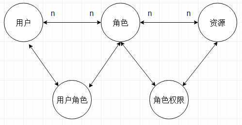
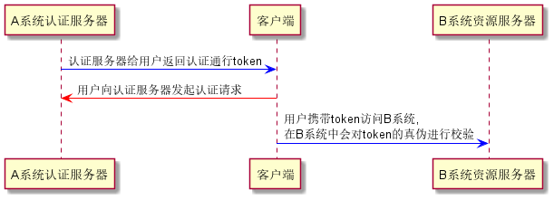
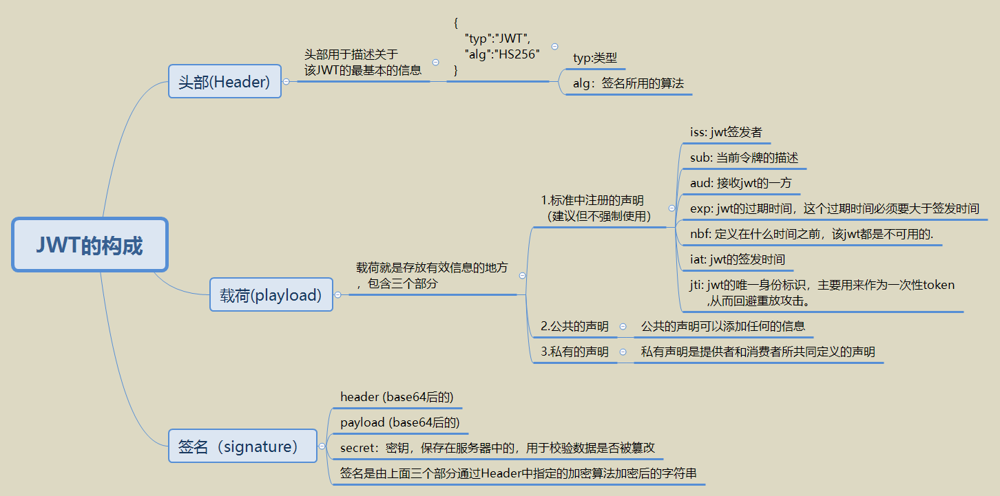

## security 权限模型

如图，是一种通用的用户权限模型。一般情况下会有5张表，分别是：用户表，角色表，权限表，用户角色关系表，角色权限对应表。  
一般，资源分配时是基于角色的（即，资源访问权限赋给角色，用户通过角色进而拥有权限）；而访问资源的时候是基于资源权限去进行授权判断的。

## Spring Security简介
Spring Security致力于为Java应用提供认证和授权管理。它是一个强大的，高度自定义的认证和访问控制框架。  
具体介绍参见https://docs.spring.io/spring-security/site/docs/5.0.5.RELEASE/reference/htmlsingle/  
这句话包括两个关键词：Authentication（认证）和 Authorization（授权，也叫访问控制）  
认证是验证用户身份的合法性，而授权是控制你可以做什么。  
简单地来说，认证就是你是谁，授权就是你可以做什么。  

### AuthenticationProvider
AuthenticationProvider接口是用于认证的，可以通过实现这个接口来定制我们自己的认证逻辑，
它的实现类有很多，默认的是JaasAuthenticationProvider
它的全称是 Java Authentication and Authorization Service (JAAS)

### AccessDecisionManager
AccessDecisionManager是用于访问控制的，它决定用户是否可以访问某个资源，实现这个接口可以定制我们自己的授权逻辑。

### AccessDecisionVoter
AccessDecisionVoter是投票器，在授权的时通过投票的方式来决定用户是否可以访问，这里涉及到投票规则。

### UserDetailsService
UserDetailsService是用于加载特定用户信息的，它只有一个接口通过指定的用户名去查询用户。

### UserDetails
UserDetails代表用户信息，即主体，相当于Shiro中的Subject。User是它的一个实现。

## 基本概念
### 单点登录

### JWT
JWT(JSON Web Token)，是一种用于通信双方之间传递安全信息的简洁的、URL安全的表述性声明规范。一个JWT实际上就是一个字符串，它由三部分组成，头部、载荷与签名
